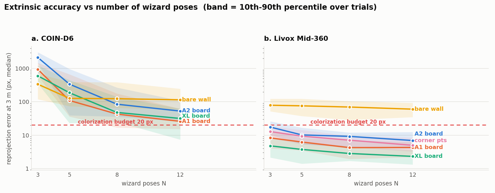
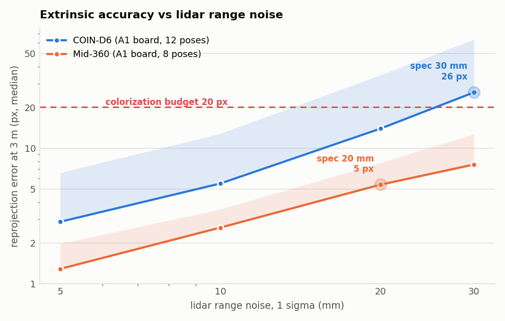
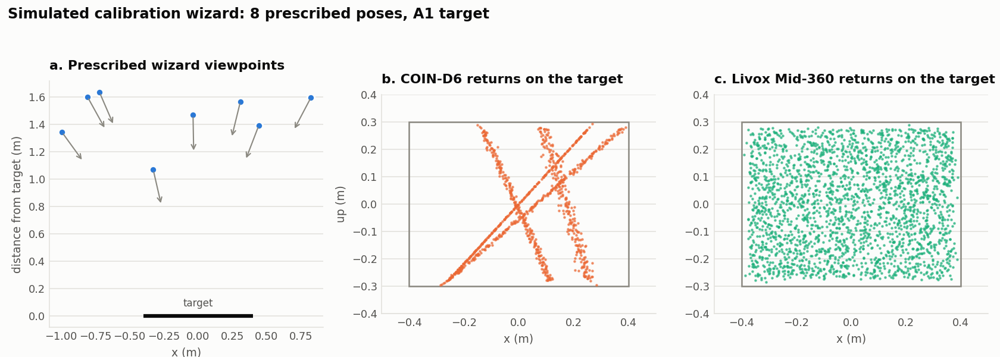
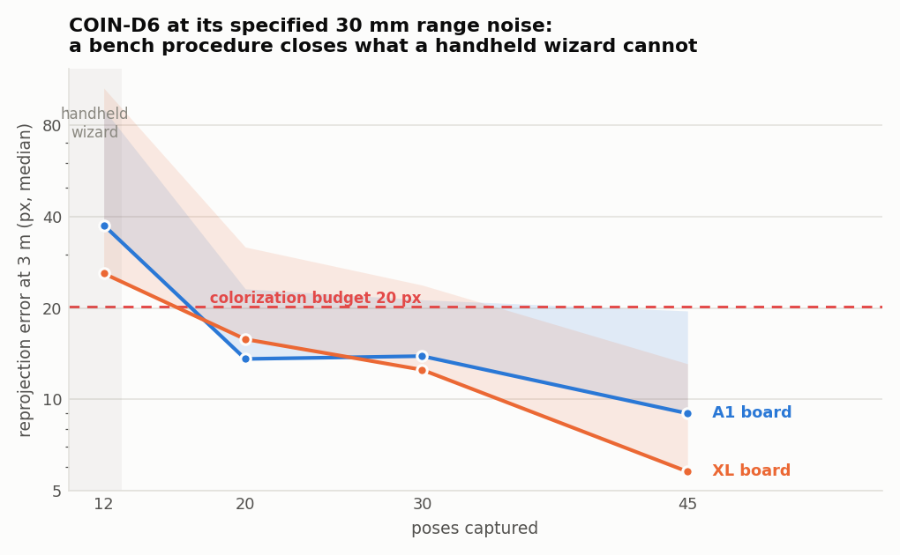
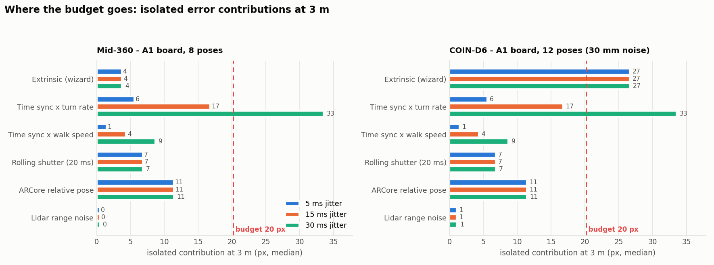
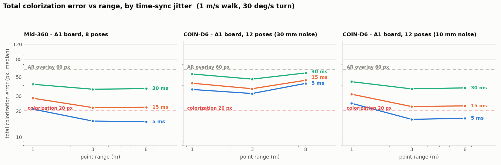
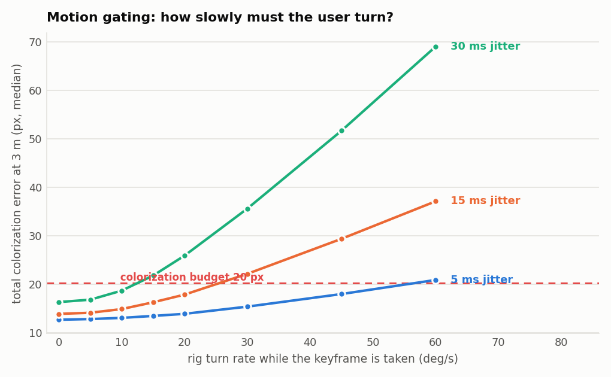

# S6 — Camera↔lidar calibration feasibility

**Spike:** S6 (Phase 0) · **Spec:** `docs/LidarScan Tech Spec.md` §3.5, §3.3, §3.2, §4
**Exit criteria:** reprojection error quantified · go/no-go on wizard design
**Deliverables:** this report · [WIZARD.md](WIZARD.md) · `sim/` `solver/` `experiments/` · `plots/` · `results/tables.md`

```
./.venv/bin/python run_all.py        # full run, ~90 s, regenerates every number below
```

---

## 1. Verdict

| Feature | Sensor | Verdict | Binding condition |
|---|---|---|---|
| **Colorization** | Livox Mid-360 | **GO WITH CAVEATS** | residual time-sync jitter ≤ 5 ms, **or** ≤ 15 ms with motion-gated keyframe selection |
| **Colorization** | COIN-D6 | **NO-GO as specified** → GO with a bench calibration | needs a one-off ~30–45-pose bench calibration, *not* a handheld wizard; and S1 must measure the real range noise |
| **AR display overlay** | both | **GO** | no new conditions; passes at all three jitter levels |
| Extrinsic wizard itself | Mid-360 | **GO** | A1 checkerboard, 8 poses, roll varied |
| Extrinsic wizard itself | COIN-D6 | **NO-GO** | physics, not solver quality — see §5 |

**Should hardware time-sync improvements be pulled into Phase 1? No.** Three cheaper software changes buy more than a hardware sync would, and one of them (the ARCore floor) caps the benefit of hardware sync anyway. See §7.

### The four numbers that decide it

Median colorization error at 3 m, walking at 1 m/s and turning at 30 °/s, with the recommended calibration. Budget = 0.5 % of image width = **20.2 px**.

| Time-sync jitter | Mid-360 | COIN-D6 (30 mm noise) | COIN-D6 (10 mm noise) |
|---|---|---|---|
| **5 ms** | **15.4 px** ✅ | 32.1 px ❌ | **16.1 px** ✅ |
| **15 ms** | **22.0 px** ⚠️ | 36.5 px ❌ | 22.7 px ⚠️ |
| **30 ms** | **36.0 px** ❌ | 47.2 px ❌ | 36.3 px ❌ |

At the spec's stated 5–30 ms of residual jitter, colorization sits **right on the edge** — it passes at the good end of that range and fails at the bad end. The spike's central recommendation is therefore not "improve the calibration" (the calibration is not the problem) but "**shrink the effective jitter**", by the three means in §7.

---

## 2. Method

A Monte-Carlo simulation in Python (numpy/scipy/matplotlib) of the whole chain, from the wizard capture through the solver to the pixel where a lidar point gets its colour.

> **Production note.** This is a prototype for sizing the error and fixing the residual definitions. The shipped solver is **C++ / Ceres** inside the engine (`color/`, `slam/pushbroom/` — spec tasks A8 and A11). The residual formulations, the pose schedule, the quality-gate metric and the pose counts in this report transfer directly; the scipy code does not.

### 2.1 Models

| Component | Model | Source |
|---|---|---|
| Camera | pinhole, 4032×3024, 26 mm-equiv → **fx = 2912 px**, HFOV 69.4°; keyframes at 2–5 fps | spec §3.5 |
| COIN-D6 | 2D, scan plane vertical, 0.9° resolution, 10 Hz, **σ_range = 30 mm**, 1.5 s dwell | spec §2.1 |
| Livox Mid-360 | 3D, 200 k pts/s, **σ_range = 20 mm**, 1.0 s dwell | spec §2.2 |
| Mount (a) | D6 vertical, 154 mm from the camera, plus a few degrees of bracket misalignment | task brief |
| Mount (b) | Mid-360 tilted 15° below the camera axis, 110 mm baseline | task brief |
| Solve seed | the bracket's CAD nominal: 4° / 25 mm from truth | a designed bracket always has one |

The stated ±20/30 mm figures are treated as **1σ**, which is conservative — datasheet numbers are usually bounds. §4 shows exactly how much that assumption matters.

### 2.2 The metric

Rotation and translation errors are reported, but every verdict is made on **reprojection error in pixels**: take points spread over the camera FOV at a given range, project them with the true extrinsic and with the estimated one, and measure the disagreement. That is what a user sees as colour bleeding across an edge.

Acceptance is the brief's **0.5 % of image width at 3 m = 20.2 px**, which at 3 m is ~21 mm of real-world smear.

For the **AR overlay** a looser 1.5 % (60 px ≈ 1.2° of visual angle) is used. Justification: the overlay is a semi-transparent point cloud whose job is to make *coverage gaps* visible during capture (spec §3.7), not to register edge-accurately; and ARCore's own world-anchoring wander is of that order regardless of what we do.

### 2.3 Solver

Non-linear least squares (`scipy.optimize.least_squares`, TRF), two residual families:

- **Plane** (checkerboard or wall): `r = n·(R·p + t) − d`, one scalar per lidar return, with `(n, d)` the target plane measured by the camera. Zhang & Pless / Unnikrishnan & Hebert.
- **Point** (corner vertices): `r = R·p + t − P`, three scalars per matched vertex.

Two-stage: plain L2 from the CAD nominal, then a soft-L1 refinement. *A robust kernel must not be used for the first stage* — from a 4° / 25 mm start every residual looks like an outlier and the solve stalls. This bit us during the spike and is worth carrying into the Ceres implementation.

### 2.4 What the simulation reproduces as a sanity check

- With zero noise the residual at ground truth is exactly zero, and the solver recovers the extrinsic to 0.000° / 0.0 mm.
- The 2D sensor needs strictly more poses than the 3D one, and N = 3 is degenerate for it — matching the classical result that Zhang–Pless needs ≥ 5 configurations.

---

## 3. Extrinsic accuracy vs number of wizard poses



Full numbers: `results/tables.md` **T1**. Median reprojection error at 3 m, px:

| Target | Sensor | N=3 | N=5 | N=8 | N=12 |
|---|---|---:|---:|---:|---:|
| A2 checkerboard | Mid-360 | 17.5 | 10.1 | 9.2 | 6.9 |
| **A1 checkerboard** | **Mid-360** | 8.3 | 6.2 | **4.2** | 4.3 |
| XL board (1.16 m) | Mid-360 | 4.8 | 3.7 | 2.8 | 2.3 |
| Corner vertices | Mid-360 | 12.8 | 9.3 | 7.1 | 4.9 |
| Bare wall (ARCore plane) | Mid-360 | 78.9 | 75.8 | 69.7 | 60.2 |
| A2 checkerboard | COIN-D6 | 2155 | 340 | 84.8 | 52.7 |
| **A1 checkerboard** | **COIN-D6** | 948 | 110 | 42.8 | **25.9** |
| Bare wall (ARCore plane) | COIN-D6 | 339 | 127 | 124 | 115 |

**Findings**

1. **Mid-360 is comfortably solved.** An A1 board and 8 poses give 0.16° / 2.6 mm → **4.2 px at 3 m**, about a fifth of the budget. Beyond 8 poses the curve is flat; asking the user for 12 buys nothing.
2. **Target size beats pose count.** A2 → A1 halves the error for both sensors at every N. For the Mid-360, XL halves it again. For the D6, XL gives no reliable gain over A1 — its deficit is not target size (§5).
3. **A bare wall is not a target.** ARCore plane detection (~1.5° normal, 15 mm offset) yields 60–115 px — 3–6× over budget on its own, for both sensors. **The camera side must be a checkerboard.** This directly answers the "checkerboard vs doorframe corner" question in the brief.
4. **Corner vertices work for the 3D sensor but are not the best option** (7.1 px at N=8 vs 4.2 px for the same-effort board), and they are **unavailable to the 2D sensor in principle** — see §5.

### 3.1 The wizard must instruct *roll* (T2)

| Sensor | Varied azimuth + elevation + **roll** | Sideways steps only, phone upright |
|---|---:|---:|
| COIN-D6 (A1, 12 poses) | 34.6 px | **80.0 px** |
| Mid-360 (A1, 8 poses) | 4.5 px | **8.7 px** |

Translation-only poses roughly double the error. For the D6 this is the single most important instruction: rolling the phone is the *only* thing that changes the direction of its scan line across the target.

---

## 4. Extrinsic accuracy vs lidar range noise



| σ_range | COIN-D6 (A1, 12 poses) | Mid-360 (A1, 8 poses) |
|---|---:|---:|
| 5 mm | 2.9 px | 1.3 px |
| 10 mm | 5.5 px | 2.6 px |
| 20 mm | 14.0 px | **5.4 px** ← spec |
| 30 mm | **25.9 px** ← spec | 7.6 px |

The Mid-360 scales roughly linearly and stays well inside budget at its specified 20 mm. The D6 degrades **super-linearly** — 6× the noise costs 9× the error — because its solve is weakly conditioned to begin with, so noise amplification compounds.

> **Blocking dependency on S1.** The D6 verdict pivots entirely on this number. At 10 mm the D6 behaves like the Mid-360; at 30 mm it does not. Datasheet "±30 mm" is a bound, not a σ. **S1 must report the measured 1σ range noise at 1–2 m** (static target, ≥1000 returns) before A8/A11 are scoped.

---

## 5. Why the COIN-D6 cannot have a handheld wizard



Panels b and c are the whole story. A 3D sensor puts a *patch* of returns on the target; the 2D sensor puts a *line*.

Consequences, all structural:

- A line of points supplies only **2 independent constraints per pose** (an offset and one slope) against the 3 a patch supplies. Six unknowns therefore need ≥ 3 poses to be determined at all and many more to be well determined — hence the catastrophic N = 3 column.
- The constrained slope is measured over a chord at most as long as the target's diagonal, so the rotation is poorly conditioned regardless of how many returns land on that line.
- **Corner/point correspondence is not available to it at all.** A 2D scanner samples a single 1D slice of the scene, so the "corner" it can find is the *bend in that slice* — and that bend slides along the corner line as the rig moves. It is not a repeatable world point, so it cannot be matched to a camera-triangulated vertex.

> **Spec correction requested.** §3.3 specifies "guided corner/doorframe capture + solver" for the D6 mount wizard, and §3.5 says the Mid-360 gets "checkerboard/corner refinement". Corner capture is viable for the **Mid-360 only**, and even there a checkerboard beats it. Recommend both sections specify a **planar checkerboard for both sensors**.

### But a bench procedure closes it



At the D6's full specified 30 mm noise (T4):

| Poses | A1 board | XL board |
|---|---:|---:|
| 12 (handheld wizard) | 37.5 px | 26.0 px |
| 20 | 13.6 px | 15.8 px |
| 30 | 13.9 px | 12.5 px |
| **45** | **9.0 px** | **5.8 px** |

Thirty to forty-five tripod poses against a large board brings the D6 inside budget **without any change to the sensor**. That is not something to ask a user to do in-app, but it is an entirely reasonable **one-off per-bracket bench calibration**, stored and reused — which also matches how the D6 is actually used (a fixed pushbroom bracket, not something re-mounted per session).

---

## 6. Error budget



Isolated contributions at 3 m, median px (T7), with the recommended calibration:

| Term | 5 ms | 15 ms | 30 ms | Notes |
|---|---:|---:|---:|---|
| Extrinsic — Mid-360 wizard | 3.7 | 3.7 | 3.7 | 18 % of budget |
| Extrinsic — D6 handheld wizard | 26.6 | 26.6 | 26.6 | over budget by itself |
| **Time sync × turn rate** | 5.6 | **16.7** | **33.5** | range-independent; **dominant** |
| Time sync × walk speed | 1.4 | 4.3 | 8.7 | decays with range |
| **Rolling shutter (20 ms readout)** | 6.8 | 6.8 | 6.8 | **correctable, currently unmodelled** |
| **ARCore relative pose** | 11.4 | 11.4 | 11.4 | **irreducible floor** |
| Lidar range noise | 0.5 | 0.5 | 1.1 | negligible |
| **TOTAL (Mid-360)** | **15.3** | **22.2** | **35.9** | |

### 6.1 Where the budget breaks first

**Time-sync jitter × turn rate — by a wide margin.** At 15 ms and 30 °/s it contributes 16.7 px alone, 83 % of the entire budget, before anything else is added. At 30 ms it is 33.5 px, over budget on its own. This term is *range-independent*: a rotation error of θ displaces a point at range r by θ·r laterally, and the projection divides by r again, so the pixel cost is `fx · θ` at every distance. Translation errors, by contrast, decay as `fx · Δ⊥ / r` — which is why the curves in `plots/p3_budget_range.png` are worst at 1 m and flat beyond 3 m.

**The extrinsic is *not* what breaks first** — for the Mid-360 it is the fourth-largest term. This is the most important structural result of the spike: **calibration quality is not the risk; time sync is.** Spec §5 lists "camera↔lidar calibration quality" as a Med-High risk; on this evidence the risk should be re-pointed at §3.2 time sync.

**A hard floor sits at ~13 px.** With a perfect extrinsic and perfect time sync, ARCore relative pose (11.4 px) and rolling shutter (6.8 px) alone give 13.3 px — **66 % of the 20.2 px budget**, spent before we do anything. The ARCore term assumes 1 cm / 0.5° absolute noise with ρ = 0.95 correlation over the sub-second keyframe-to-point window (the slow drift is common-mode and cancels; only the relative error matters), giving 3.2 mm / 0.16° relative. If ARCore's short-term relative accuracy is better than that in practice, this floor drops and everything gets easier — worth measuring on the bench alongside S1.

### 6.2 Vs range



Error is worst at 1 m (translation-dominated), flattens beyond 3 m (rotation-dominated). The D6-at-30 mm panel *rises* again at 8 m: a poorly conditioned solve trades rotation against translation so that the two partially cancel near the ~1.5 m calibration distance, and that cancellation breaks down far from it. Practical consequence: **capture wizard poses at a distance representative of use**, and do not extrapolate a calibration far beyond it.

### 6.3 Motion gating is the cheapest fix available



Median error at 3 m vs the rig's turn rate when the keyframe is taken (T8):

| Turn rate | 5 ms | 15 ms | 30 ms |
|---|---:|---:|---:|
| 0 °/s | 12.6 | 13.8 | 16.3 |
| 10 °/s | 13.0 | **14.8** ✅ | **18.7** ✅ |
| 15 °/s | 13.4 | **16.2** ✅ | 21.8 |
| 20 °/s | 13.9 | 17.8 | 25.9 |
| 30 °/s | 15.3 | 22.1 | 35.6 |
| 60 °/s | 20.8 | 37.1 | 69.0 |

Colorization already does **best-view keyframe selection** (spec §3.5). Adding the rig's angular rate as a selection term costs nothing — the rate is already available from ARCore and, for the Mid-360, from its own 200 Hz IMU. Doing so converts a fail into a pass:

- at **15 ms**, preferring keyframes taken below **15 °/s** brings 3 m error to 16.2 px ✅
- at **30 ms**, the threshold tightens to **10 °/s** → 18.7 px ✅

Walking scans spend most of their time below 15 °/s, so the cost is a modest reduction in usable keyframes, not a hole in coverage. Points that can only be seen from fast-turn frames should be coloured anyway but flagged low-confidence — the same treatment §3.3 already gives ARCore tracking-loss points.

---

## 7. Recommendations

### 7.1 Should hardware time-sync be pulled into Phase 1? — No

Recommend **against**. Three software changes deliver the needed reduction sooner and cheaper, and the ARCore floor caps what a hardware sync could win:

| # | Change | Owner | Effect |
|---|---|---|---|
| 1 | **Estimate the constant camera↔lidar clock offset** in the mount wizard (WIZARD.md screen 3: an 8-second sweep, cross-correlate the target's bearing in both sensors). | A4 + B7 | Removes the *systematic* half of the sync error; leaves only the jitter this budget is written against. Highest value per unit of work in the whole spike. |
| 2 | **Model rolling shutter** as a per-row time offset in the colorization projection. | A11 | −6.8 px, free. Currently unmodelled and silently spending a third of the budget. |
| 3 | **Motion-gate keyframe selection** on angular rate. | A11 | Converts 15 ms (and even 30 ms) from fail to pass. |

A hardware sync (PPS/PTP) would take the sync term toward zero, but the residual floor would still be ~13 px, i.e. 66 % of budget — so hardware sync buys at most the difference between 15.3 px and 13.3 px once the three items above are done. It is not worth Phase 1 schedule risk. **Revisit in Phase 2** *if* bench measurement shows the arrival-correlation jitter is worse than 30 ms, or if ARCore relative accuracy turns out better than assumed (which would make the sync term the sole remaining barrier).

### 7.2 Actions

| # | Action | Owner | Blocking? |
|---|---|---|---|
| A | **S1 must report measured D6 1σ range noise at 1–2 m.** The D6 colorization verdict depends on it. | S1 | **Yes**, for A8/A11 scoping |
| B | Amend spec §3.3 / §3.5: planar **checkerboard for both sensors**; corner capture is not viable for a 2D scanner. | spec | Yes, before B7 |
| C | Add a **per-bracket bench calibration** (30–45 poses, tripod, ≥ A1 board) for the D6; the in-app wizard becomes verify-and-correct only. | A8, B7 | Yes, for D6 colorization |
| D | Implement items 1–3 of §7.1. | A4, A11, B7 | Yes, for colorization at all |
| E | Re-point the spec §5 risk row from "camera↔lidar calibration quality" (Med-High) to **"time-sync quality for colorization"**. Calibration is solved; sync is not. | spec | No |
| F | Measure **ARCore short-term relative pose accuracy** on the target phones (relative error over 0.25 s windows). It sets a floor at 56 % of budget under current assumptions. | S4/E3 bench | No, but high value |
| G | Ship the **split-half quality gate** (WIZARD.md §2 screen 4), not the solver covariance — measured rank correlation of the covariance with true error is ≈ 0.1. | A8/A11 | No |

### 7.3 What the wizard must achieve

Full design in **[WIZARD.md](WIZARD.md)**. Headline requirements:

- **A1 checkerboard minimum** (0.80 × 0.60 m), rigid backing, standing ≥ 0.5 m clear of the wall.
- **8 poses** (Mid-360). Prescribed as a low-discrepancy sweep of azimuth ±38°, elevation −24…+26° and **roll ±60°** — roll is not optional.
- **Auto-shutter on all-green checks**, so the user never presses a button while holding the rig.
- **Split-half agreement as the quality gate**, shown as physical units ("±2 cm at 3 m"), with pass ≤ 12 px, reject > 30 px. The gate reads ~2.5× true error on a good capture and explodes on a bad one, which is the behaviour a safety gate wants.
- **An 8-second time-offset sweep** — the highest-value step in the wizard, because it attacks the dominant error term.
- **A live AR verify screen** at the end, because it catches failure classes no residual can.

---

## 8. Limitations

1. **Simulation, not hardware.** Every conclusion is conditional on the models in §2.1. The three assumptions most worth checking on the bench, in order: D6 range noise (action A), ARCore short-term relative accuracy (action F), and the achievable residual sync jitter.
2. **No lens distortion, no intrinsics error.** ARCore supplies per-device intrinsics and phone lenses are well corrected; a residual 0.5 px of distortion would add in quadrature and change nothing. Not true if a wide/ultra-wide lens is used for capture — that should be re-checked if the capture lens changes.
3. **Segmentation is assumed to work.** The simulator hands the solver the returns that lie on the target. Real board segmentation from the background is a solved problem given the ≥ 0.5 m standoff the wizard enforces, but it is not free, and it is where a real D6 wizard would encounter extra failure modes.
4. **No occlusion / best-view competition.** The budget measures where a point lands, not whether the right keyframe was chosen. The z-buffer occlusion test in §3.5 is a separate error source not covered here.
5. **Rolling shutter modelled as a linear per-row offset** with a 20 ms readout. Real readout varies by phone and capture mode; it should be measured per device (it is measurable from an ARCore-timestamped rolling-shutter test pattern).

---

## 9. Files

| Path | What |
|---|---|
| `run_all.py` | single entry point; regenerates everything |
| `sim/geom.py` | SE(3) helpers |
| `sim/rig.py` | camera + lidar models, the two ground-truth mounts, the reprojection metric |
| `sim/targets.py` | room scene, checkerboard/wall/corner targets, wizard pose schedule, sensor observation models |
| `solver/extrinsic.py` | the 6-DoF solver (plane + point residuals, two-stage robust fit, covariance) |
| `experiments/campaign.py` | one simulated wizard session end to end; split-half gate |
| `experiments/budget.py` | the colorization error-budget Monte Carlo |
| `experiments/style.py` | plot styling (validated categorical palette) |
| `plots/p0…p6*.png` | figures used above |
| `results/tables.md` | T1–T8, every generated number |
| `results/results.json` | machine-readable budget summary |
